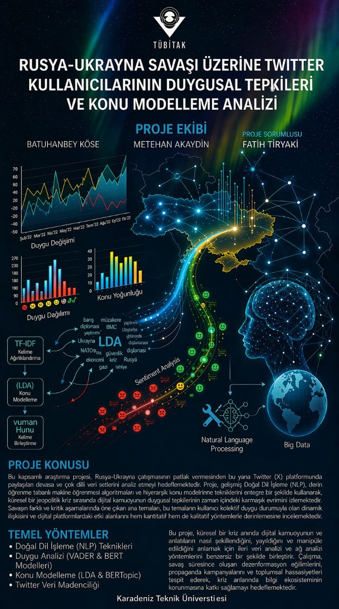

# Rusya-Ukrayna Savaşı Twitter Duygu Analizi



Bu repo, TÜBİTAK projemiz için hazırladığım Twitter duygu analizi çalışmasını içeriyor. Çalışmanın amacı, Rusya-Ukrayna savaşı hakkında atılan tweetleri duygu durumlarına göre sınıflandırmak.

Model tarafında `xlm-roberta-base` kullandım. Veri hazırlama, etiketleme, çeviri, eğitim ve tahmin işlemlerini ayrı Python dosyaları halinde tuttum. Ayrıca modeli denemek için basit bir Flask API ve web arayüzü de ekledim.

## Sınıflar

Model tweetleri 5 sınıfa ayırıyor:

- `mutlu`
- `uzgun`
- `kizgin`
- `saskin`
- `notr`

## Dosyalar

- `api.py`: Eğitilmiş modeli Flask API olarak çalıştırır.
- `terminal.py`: Terminalden tweet/metin girerek tahmin almaya yarar.
- `site.html`: API'ye istek atan basit web arayüzü.
- `cmodel.py`: İlk model eğitim dosyası.
- `fine_tune.py`: Türkçeye çevrilmiş veriyle ek fine-tuning dosyası.
- `translator.py`: İngilizce tweetleri Türkçeye çevirmek için kullandığım dosya.
- `etiketleyenc.py`: VADER ve anahtar kelime tabanlı ilk etiketleme dosyası.
- `requirements.txt`: Gerekli Python kütüphaneleri.

## Kurulum

Önce sanal ortam oluşturup gerekli kütüphaneleri kurmak gerekiyor:

```bash
python -m venv .venv
.venv\Scripts\activate
pip install -r requirements.txt
```

Linux/macOS kullanılıyorsa aktivasyon komutu:

```bash
source .venv/bin/activate
```

## Model Klasörü

Model dosyaları büyük olduğu için bu repoya eklemedim. Model Hugging Face tarafında paylaşılacak.

Varsayılan model yolu:

```text
models/sentiment_model_v2
```

Farklı bir model klasörü kullanılacaksa PowerShell'de şöyle verilebilir:

```powershell
$env:MODEL_DIR="models/sentiment_model_v2"
python api.py
```

## API ile Çalıştırma

```bash
python api.py
```

API çalıştıktan sonra örnek istek:

```bash
curl -X POST http://localhost:5000/predict -H "Content-Type: application/json" -d "{\"text\":\"Bugün savaşla ilgili çok üzücü haberler var.\"}"
```

## Terminalden Deneme

```bash
python terminal.py
```

## Eğitim Dosyaları

İlk eğitim için:

```bash
python cmodel.py
```

Türkçeye çevrilmiş veriyle fine-tuning için:

```bash
python fine_tune.py
```

Veri yolları dosyaların içinde varsayılan olarak `data/` klasörüne göre ayarlı. Gerekirse `INPUT_FILE`, `OUTPUT_FILE`, `BASE_MODEL`, `TR_DATA` ve `OUTPUT_DIR` değişkenleriyle farklı yollar verilebilir.

## Not

Ham veri dosyalarını ve model ağırlıklarını repoya koymadım. Hem dosyalar büyük olduğu için hem de Twitter/X verilerinde kullanıcı bilgisi bulunabileceği için bunları ayrı tutmak daha doğru oldu.
